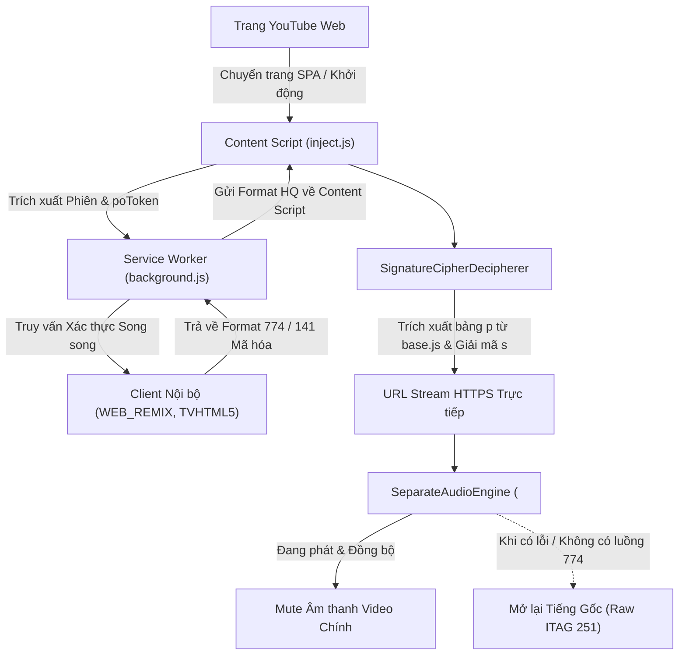

<div align="center">
  
  <h1>YTSpoofingStream</h1>
  <p><b>Mở khóa Âm thanh YouTube Bitrate Cao Thực Thụ (256kbps+ Opus & AAC) trên Trình duyệt Web</b></p>

  <p>
    <a href="https://github.com/alithw/YTSpoofingStream/releases"></a>
    
    
    
  </p>
</div>

> [!WARNING]
> **Yêu cầu: Tài khoản YouTube Premium đang hoạt động**
> Tiện ích mở rộng này được thiết kế chuyên biệt cho người dùng sở hữu tài khoản **YouTube Premium**. Các máy chủ nội bộ của YouTube chỉ cung cấp luồng Opus bitrate cao (`itag 774`, ~276kbps) và AAC (`itag 141`, ~256kbps) cho các phiên đăng nhập Premium đã xác thực. Các phiên không có Premium sẽ tự động chuyển về định dạng tiêu chuẩn gốc (`itag 251` / `140`).

> [!IMPORTANT]
> **Hỗ trợ đầy đủ luồng Opus 774 (Xác thực TVHTML5)**:
> Để mở khóa và phát toàn diện luồng Opus 774 trên mọi video, bạn hãy đăng nhập vào phần **TVHTML5** trên extension:
> 1. Mở popup extension và nhấn vào nút đăng nhập **TVHTML5**.
> 2. Đảm bảo đăng nhập đúng tài khoản Google có YouTube Premium.
> 3. Sau khi login xong và hệ thống hiển thị status là thành công $\rightarrow$ **Enjoy highest quality!**

*Đọc bằng ngôn ngữ khác: [English](README.md).*

---

## 📑 Mục lục
- [🌟 Tại sao bạn cần YTSpoofingStream?](#-tại-sao-bạn-cần-ytspoofingstream)
- [✨ Điểm mới trong bản v0.1.2](#-điểm-mới-trong-bản-v012)
- [🔥 Tính năng Nổi bật](#-tính-năng-nổi-bật)
- [🧠 Kiến trúc Kỹ thuật & Phân tích Chuyên sâu](#-kiến-trúc-kỹ-thuật--phân-tích-chuyên-sâu)
  - [1. Động cơ Giả mạo Đa nền tảng (Multi-Client)](#1-động-cơ-giả-mạo-đa-nền-tảng-multi-client)
  - [2. Bộ giải mã Tự động SignatureCipherDecipherer](#2-bộ-giải-mã-tự-động-signaturecipherdecipherer)
  - [3. Trình phát Âm thanh Riêng biệt (SeparateAudioEngine)](#3-trình-phát-âm-thanh-riêng-biệt-separateaudioengine)
  - [4. Bảo vệ Luồng Video Gốc & Cơ chế Fallback An toàn](#4-bảo-vệ-luồng-video-gốc--cơ-chế-fallback-an-toàn)
  - [5. Đồng bộ Bảng Thống kê & Dashboard Thời gian thực](#5-đồng-bộ-bảng-thống-kê--dashboard-thời-gian-thực)
- [🚀 Hướng dẫn Cài đặt](#-hướng-dẫn-cài-đặt)
- [⚙️ Tùy chọn Cấu hình & Điều khiển](#️-tùy-chọn-cấu-hình--điều-khiển)
- [⚠️ Giới hạn đã biết](#️-giới-hạn-đã-biết)
- [🐞 Báo cáo Lỗi & Hỗ trợ](#-báo-cáo-lỗi--hỗ-trợ)
- [🤝 Đóng góp vào Dự án](#-đóng-góp-vào-dự-án)
- [📄 Giấy phép (License)](#-giấy-phép-license)

---

## 🌟 Tại sao bạn cần YTSpoofingStream?

Trình phát YouTube trên Web hiện nay giới hạn âm thanh ở mức bitrate thấp (**ITAG 251** Opus ~145-160kbps bị vát ngọn dải tần cao ở 15-16kHz, hoặc **ITAG 140** AAC ~128kbps), ngay cả với người dùng trả phí YouTube Premium. Luồng âm thanh cao cấp không nén dải tần (**ITAG 774** Opus ~276kbps lên tới 22kHz, và **ITAG 141** AAC 256kbps) chỉ được mở cho một số client đặc thù (YouTube Music, ứng dụng di động Android/iOS, Smart TV).

**YTSpoofingStream** giải quyết triệt để rào cản này. Tiện ích hoạt động như một proxy thông minh chạy ngầm trong trình duyệt, truy vấn luồng âm thanh bitrate cao thực thụ từ các client nội bộ và phát song song mượt mà với video gốc.

---

## ✨ Điểm mới trong bản v0.1.2

- 🛑 **Khối Master Bật/Tắt Toàn Hệ thống**: Tách riêng công tắc Master Switch kèm hiệu ứng làm mờ giao diện (`opacity: 0.35`, `pointer-events: none`). Khi tắt, tiện ích lập tức xóa sạch các quy tắc Declarative Net Request (DNR) và ngắt toàn bộ can thiệp mạng, trả về trình phát gốc 100%.
- 🎵 **Sử dụng YouTube Music (`music.youtube.com`) Chỉ Với 1 Click**: Bạn không còn phải vào trang quản lý `chrome://extensions` để gỡ hay tắt tiện ích mỗi khi nghe YouTube Music. Giờ đây chỉ cần gạt `Enable Extension: OFF` ngay trên giao diện popup là có thể nghe YouTube Music hoàn toàn bình thường không hề bị chặn.
- 🚫 **Loại bỏ Hoàn toàn ITAG Âm thanh Bitrate Thấp**: Tự động thanh lọc các ITAG `[250, 249, 140, 139]` ra khỏi danh sách `adaptiveFormats`, ngăn chặn triệt để thuật toán ABR của YouTube tự hạ chất lượng xuống Opus 250 (50kbps) khi xem ở độ phân giải thấp.
- 🛡️ **Khắc phục Lỗi 403 Forbidden & Ngăn Chặn Fallback**: Bộ lọc ứng viên stream ưu tiên direct URL hợp lệ, loại bỏ các chuỗi decipher lỗi thời để đảm bảo không bao giờ bị rơi vào fallback.

---

## 🔥 Tính năng Nổi bật

- **Khôi phục Trọn vẹn Dải tần Âm thanh**: Mở rộng dải tần âm thanh lên đến 22kHz Hi-Fi chuẩn phòng thu.
- **Truy vấn Đa Client Song song**: Gọi đồng thời các client `WEB_REMIX`, `TVHTML5`, `ANDROID` và `IOS` qua Service Worker.
- **Vượt rào BotGuard**: Tự động trích xuất và đính kèm `poToken`, `visitorData` và `SAPISIDHASH` từ phiên duyệt web thực tế.
- **Không Gián đoạn Phát Video**: Giữ nguyên vẹn 100% luồng video gốc (`SABR`, `1080p`, `4K`, `AV1/VP9`).
- **Giao diện Bảng điều khiển Trực quan**: Theo dõi thời gian thực ITAG đang hoạt động, bitrate đo lường, và trạng thái của từng client.

---

## 🧠 Kiến trúc Kỹ thuật & Phân tích Chuyên sâu



### 1. Động cơ Giả mạo Đa nền tảng (Multi-Client)
Service Worker của tiện ích gửi các truy vấn song song đến `/youtubei/v1/player` giả lập các client `WEB_REMIX` (YouTube Music Web) và `TVHTML5` (Smart TV). Nhờ chuyển tiếp đầy đủ định danh phiên đăng nhập (`SAPISIDHASH`, `VISITOR_DATA`), máy chủ YouTube cấp quyền truy cập các luồng âm thanh chất lượng cao.

### 2. Bộ giải mã Tự động SignatureCipherDecipherer
Các định dạng âm thanh bản quyền đi kèm các tham số `s`, `sp` và `url`. `SignatureCipherDecipherer` nạp file script `base.js` hiện hành, trích xuất mảng chuỗi `p`, ánh xạ đối tượng thao tác `Cy` và thực thi thuật toán giải mã:
$$\text{sig} = wU(8, 2934, wU(2, 8414, \text{decodeURIComponent}(s)))$$
Chữ ký sau giải mã được ghép trực tiếp vào URL phát, cho phép nạp luồng phát trực tiếp tốc độ cao.

### 3. Trình phát Âm thanh Riêng biệt (`SeparateAudioEngine`)
Thay vì can thiệp vào bộ giải mã MSE gốc của YouTube dễ gây lỗi gián đoạn phát (SABR desync), `SeparateAudioEngine` truyền luồng âm thanh vào một thẻ audio HTML5 ẩn kết nối Web Audio API (`AudioContext` $\rightarrow$ `GainNode` $\rightarrow$ `Loa/Tai nghe`). Động cơ liên tục đồng bộ:
- Tự động bám sát các sự kiện `play`, `pause`, `seeking`, `seeked`, và `playbackRate`.
- Tự động căn chỉnh lại thời gian nếu độ lệch (drift) vượt quá 80ms.
- Hỗ trợ khuếch đại âm lượng phần cứng từ 0% đến 200%.

### 4. Bảo vệ Luồng Video Gốc & Cơ chế Fallback An toàn
Dữ liệu streaming của video gốc (`adaptiveFormats`, `serverAbrStreamingUrl`, `dashManifestUrl`) được giữ nguyên vẹn 100%. Khi video không có track 774, hoặc khi xảy ra sự cố mạng, `SeparateAudioEngine.stopAndUnmute()` lập tức kích hoạt `mainVideo.muted = false`, đảm bảo video luôn phát mượt mà với âm thanh gốc tốt nhất (ITAG 251 / 140).

### 5. Đồng bộ Bảng Thống kê & Dashboard Thời gian thực
Khi bật tùy chọn *Stats for Nerds Override*, dòng Codecs hiển thị bitrate thực tế đo lường được (`opus (774) 276k [HQ Spoofed]`). Khi ở chế độ fallback, hệ thống giữ nguyên định dạng raw chân thực (`av01... / opus (251)`).

---

## 🚀 Hướng dẫn Cài đặt

1. Tải bản phát hành zip mới nhất tại mục [Releases](https://github.com/alithw/YTSpoofingStream/releases) hoặc clone mã nguồn:
   ```bash
   git clone https://github.com/alithw/YTSpoofingStream.git
   ```
2. Mở trình duyệt Google Chrome và truy cập `chrome://extensions/`.
3. Bật **Chế độ dành cho nhà phát triển (Developer mode)** ở góc trên bên phải.
4. Nhấn **Tải tiện ích đã giải nén (Load unpacked)** và chọn thư mục `YTSpoofingStream` (nơi chứa file `manifest.json`).
5. Mở YouTube, đảm bảo đã đăng nhập tài khoản Premium và thưởng thức âm thanh chất lượng cao!

---

## ⚙️ Tùy chọn Cấu hình & Điều khiển

| Tùy chọn | Mặc định | Ý nghĩa |
|---|---|---|
| **Enable Extension** | `BẬT` | Bật/tắt toàn bộ tiện ích. |
| **Fetch HQ Audio (Multi-client)** | `BẬT` | Truy vấn đa client để săn lùng định dạng bitrate cao. |
| **Force Override** | `BẬT` | Ưu tiên chọn ITAG 774/141 thay cho luồng web thông thường. |
| **Auto-reload page on change** | `BẬT` | Tự động làm mới trang khi thay đổi cấu hình. |
| **Raw ITAG (no disguise)** | `TẮT` | Giữ nguyên mã itag gốc mà không ngụy trang. |
| **Stats for Nerds Override** | `BẬT` | Hiển thị thông tin Opus 774 trên bảng Thống kê chi tiết của YouTube. |
| **Native Audio DSP Gain** | `100%` | Thanh trượt khuếch đại âm lượng từ 0% đến 200%. |

---

## ⚠️ Giới hạn đã biết & Lưu ý Tương thích

> [!TIP]
> **Tương thích Mượt mà với YouTube Music (`music.youtube.com`)**
> Bạn **không cần phải vào cài đặt Chrome (`chrome://extensions`) để tắt tiện ích**! Khi muốn nghe nhạc trên **[music.youtube.com](https://music.youtube.com)**, bạn chỉ cần gạt **`Enable Extension: OFF`** ngay trên giao diện Popup của extension. Thao tác này sẽ giải phóng toàn bộ các hook can thiệp mạng và quy tắc DNR, cho phép Service Worker nội bộ của YouTube Music khởi tạo và phát nhạc nguyên bản 100%. Gạt bật lại **`ON`** bất cứ khi nào bạn quay trở lại YouTube thường (`www.youtube.com`) để tiếp tục thưởng thức âm thanh Opus 774 chất lượng cao!

| Dịch vụ | Mức độ tương thích |
|---|---|
| `youtube.com` | ✅ Hỗ trợ đầy đủ (Video thông thường, MV Vevo, Công chiếu, Livestream) |
| `music.youtube.com` | ⚠️ Khuyến nghị tắt tiện ích để có trải nghiệm YT Music nguyên bản |

---

## 🐞 Báo cáo Lỗi & Hỗ trợ

Nếu gặp hiện tượng bất thường khi phát:
1. Mở popup tiện ích và chụp ảnh màn hình phần **Status**.
2. Mở Chrome DevTools (`F12` $\rightarrow$ Console) và lọc từ khóa `[YTSS]`.
3. Tạo Issue trên GitHub kèm theo link video, ảnh chụp và nhật ký lỗi.

---

## 🤝 Đóng góp vào Dự án

Mọi đóng góp, báo lỗi và ý tưởng tối ưu hóa đều được hoan nghênh!
1. Fork Dự án (`https://github.com/alithw/YTSpoofingStream/fork`).
2. Tạo nhánh tính năng (`git checkout -b feature/TinhNangMoi`).
3. Commit thay đổi (`git commit -m 'Thêm TinhNangMoi'`).
4. Push lên nhánh (`git push origin feature/TinhNangMoi`).
5. Tạo Pull Request trên GitHub.

---

## 📄 Giấy phép (License)

Phát hành dưới **Giấy phép MIT**. Xem chi tiết tại [`LICENSE`](LICENSE).
