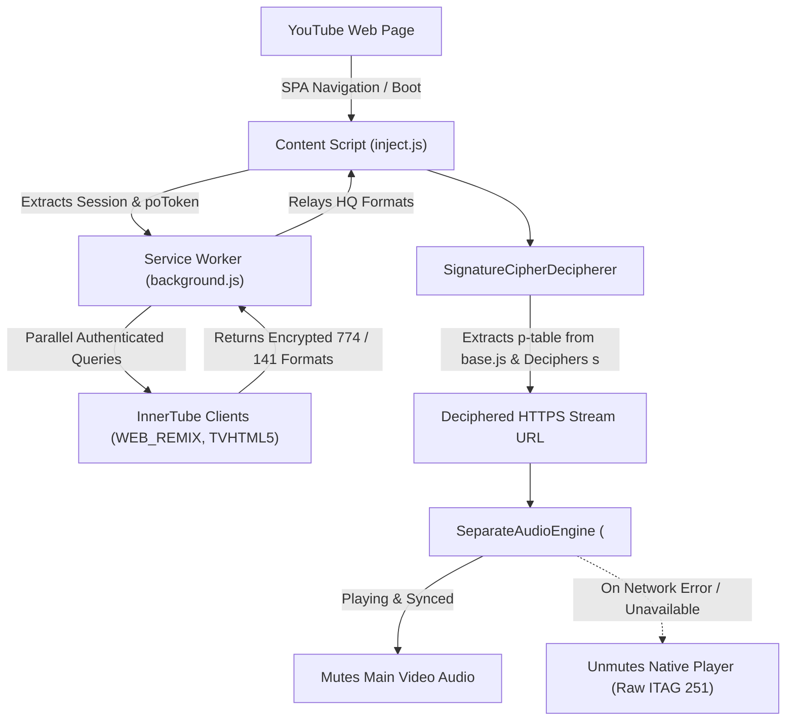

<div align="center">
  
  <h1>YTSpoofingStream</h1>
  <p><b>Unlock Real High-Bitrate YouTube Audio (256kbps+ Opus & AAC) on Web Player</b></p>

  <p>
    <a href="https://github.com/alithw/YTSpoofingStream/releases"></a>
    
    
    
  </p>
</div>

> [!WARNING]
> **Requirement: Active YouTube Premium Subscription**
> This extension is engineered specifically for users with an active **YouTube Premium** subscription. YouTube's internal servers only serve unthrottled high-bitrate Opus (`itag 774`, ~276kbps) and AAC (`itag 141`, ~256kbps) to authenticated Premium sessions. Non-premium requests will seamlessly fall back to standard raw formats (`itag 251` / `140`).

> [!IMPORTANT]
> **Full Opus 774 Stream Support (TVHTML5 Authentication)**:
> To unlock and stream full-spectrum Opus 774 audio across all video types, please log in via the **TVHTML5** section in the extension:
> 1. Open the extension popup and click the **TVHTML5** login button.
> 2. Ensure you sign in with the correct Google account that has an active YouTube Premium subscription.
> 3. Once logged in and the popup displays a successful status $\rightarrow$ **Enjoy highest quality!**

*Read this in other languages: [Tiếng Việt](README-vi.md).*

---

## 📑 Table of Contents
- [🌟 Why YTSpoofingStream?](#-why-ytspoofingstream)
- [✨ What's New in v0.1.2](#-whats-new-in-v012)
- [🔥 Key Features](#-key-features)
- [🧠 Technical Architecture & Deep Dive](#-technical-architecture--deep-dive)
  - [1. Multi-Client Spoofing Engine](#1-multi-client-spoofing-engine)
  - [2. Built-in SignatureCipher Decipherer](#2-built-in-signaturecipher-decipherer)
  - [3. Dedicated High-Fidelity Audio Engine (SeparateAudioEngine)](#3-dedicated-high-fidelity-audio-engine-separateaudioengine)
  - [4. Fail-safe Native Stream Protection & Fallback](#4-fail-safe-native-stream-protection--fallback)
  - [5. Dynamic Stats for Nerds & Dashboard Synchronization](#5-dynamic-stats-for-nerds--dashboard-synchronization)
- [🚀 Installation](#-installation)
- [⚙️ Configuration & Controls](#️-configuration--controls)
- [⚠️ Known Limitations](#️-known-limitations)
- [🐞 Reporting Issues & Troubleshooting](#-reporting-issues--troubleshooting)
- [🤝 Contributing](#-contributing)
- [📄 License](#-license)

---

## 🌟 Why YTSpoofingStream?

Modern YouTube Web Player artificially restricts audio playback to low-bitrate streams (**ITAG 251** Opus at ~145-160kbps with high-frequency cutoff at 15-16kHz, or **ITAG 140** AAC at ~128kbps), even for paying YouTube Premium subscribers. Premium-grade unclipped audio (**ITAG 774** Opus at ~276kbps up to 22kHz, and **ITAG 141** AAC at 256kbps) is restricted to selected client ecosystems (YouTube Music, Android/iOS apps, and Smart TVs).

**YTSpoofingStream** bridges this gap. It acts as an intelligent client proxy directly within your browser, fetching authentic high-bitrate streams through authenticated internal endpoints and rendering full-spectrum sound seamlessly alongside native video.

---

## ✨ What's New in v0.1.2

- 🛑 **Master Enable/Disable Subsystem**: Standalone Master toggle with visual dimming (`opacity: 0.35`, `pointer-events: none`). Switching off instantly clears all Declarative Net Request (DNR) session rules and unhooks all network interceptors, returning browser playback to 100% native.
- 🎵 **Full YouTube Music (`music.youtube.com`) Isolation**: Added explicit exclusion matches so YouTube Music runs completely untouched with its native Service Worker and queue intact.
- 🚫 **Strict Low-Bitrate ITAG Stripping**: Automatically purges `[250, 249, 140, 139]` from `adaptiveFormats`, permanently blocking YouTube ABR from dropping audio quality down to 50kbps (Opus 250) on low video resolutions.
- 🛡️ **Eliminated 403 Forbidden Stream Fallbacks**: Stream candidates strictly prioritize valid direct URLs, preventing signature decipher failures and unwanted fallbacks.

---

## 🔥 Key Features

- **True Unclipped Audio Spectrum**: Restores frequencies above 16kHz up to full 22kHz Hi-Fi audio.
- **Multi-Client Query Pipeline**: Queries `WEB_REMIX`, `TVHTML5`, `ANDROID`, and `IOS` in parallel via background Service Worker.
- **Client Session Tunneling**: Relays live `poToken`, `visitorData`, and `SAPISIDHASH` session credentials to pass BotGuard anti-bot checks.
- **Zero Video Playback Interruption**: Native video tracks (`SABR`, `1080p`, `4K`, `AV1/VP9`) remain 100% untouched and uncorrupted.
- **Comprehensive Popup Dashboard**: Real-time status monitor showing active itags, source clients, exact bitrates, and client availability matrices.

---

## 🧠 Technical Architecture & Deep Dive



### 1. Multi-Client Spoofing Engine
The extension’s Service Worker performs parallel background queries to `/youtubei/v1/player` mimicking `WEB_REMIX` (YouTube Music Web) and `TVHTML5` (Living Room/Smart TV) clients. By forwarding the active browser session (`SAPISIDHASH`, `VISITOR_DATA`, `DELEGATED_SESSION_ID`), the server recognizes the user's Premium subscription and returns high-tier formats.

### 2. Built-in SignatureCipher Decipherer
Encrypted music formats provide parameters `s`, `sp`, and `url` instead of direct URLs. `SignatureCipherDecipherer` dynamically fetches the active `base.js` player script, extracts the obfuscated string array `p`, builds the transformation mapping `Cy`, and evaluates the decipher algorithm:
$$\text{sig} = wU(8, 2934, wU(2, 8414, \text{decodeURIComponent}(s)))$$
The deciphered signature is appended to the stream URL, yielding direct unthrottled streaming access.

### 3. Dedicated High-Fidelity Audio Engine (`SeparateAudioEngine`)
Rather than forcing modified audio streams into the native Media Source Extensions (MSE) pipeline which can cause SABR desynchronization, `SeparateAudioEngine` loads the unthrottled audio into a dedicated, low-latency HTML5 audio element driven by Web Audio API (`AudioContext` $\rightarrow$ `GainNode` $\rightarrow$ `Destination`). It attaches drift-correction listeners to the main video player:
- Synchronizes `play`, `pause`, `seeking`, `seeked`, and `playbackRate`.
- Corrects clock drift exceeding 80ms.
- Provides dynamic volume boosting (0% – 200%).

### 4. Fail-safe Native Stream Protection & Fallback
The native video player's `streamingData.adaptiveFormats` and manifest endpoints (`serverAbrStreamingUrl`, `dashManifestUrl`, `hlsManifestUrl`) are kept fully intact. If a video lacks an ITAG 774 track, or if decryption fails, `SeparateAudioEngine.stopAndUnmute()` ensures `mainVideo.muted = false`, delivering smooth, uninterrupted playback using the best available raw original stream (ITAG 251 / 140).

### 5. Dynamic Stats for Nerds & Dashboard Synchronization
When *Stats for Nerds Override* is enabled, the codec line dynamically calculates and renders real measured bitrates (`opus (774) 276k [HQ Spoofed]`). When playing fallback streams, it preserves 100% authentic raw telemetry (`av01... / opus (251)`).

---

## 🚀 Installation

1. Download the latest `v0.1.2` release zip from [Releases](https://github.com/alithw/YTSpoofingStream/releases) or clone the repository:
   ```bash
   git clone https://github.com/alithw/YTSpoofingStream.git
   ```
2. Open Google Chrome and navigate to `chrome://extensions/`.
3. Enable **Developer mode** in the top-right corner.
4. Click **Load unpacked** and select the `YTSpoofingStream` folder (containing `manifest.json`).
5. Open YouTube, verify your Premium login, and enjoy Hi-Fi audio streaming!

---

## ⚙️ Configuration & Controls

| Option | Default | Description |
|---|---|---|
| **Enable Extension** | `ON` | Master switch to enable/disable background fetching and injection. |
| **Fetch HQ Audio (Multi-client)** | `ON` | Queries multiple internal clients for high-bitrate streams. |
| **Force Override** | `ON` | Prioritizes ITAG 774/141 over standard web streams. |
| **Auto-reload page on change** | `ON` | Reloads the active tab automatically when settings change. |
| **Raw ITAG (no disguise)** | `OFF` | Passes raw itag numbers without disguise mapping. |
| **Stats for Nerds Override** | `ON` | Formats and displays HQ Opus 774 in YouTube's Stats for Nerds overlay. |
| **Native Audio DSP Gain** | `100%` | Hardware-accelerated audio amplifier slider (0% to 200%). |

---

## ⚠️ Known Limitations

> [!CAUTION]
> **YouTube Music (`music.youtube.com`) Compatibility**
> When this extension is enabled, `music.youtube.com` background pre-fetching may conflict with queue management. If using YouTube Music, please temporarily toggle the extension off via the popup.

| Service | Compatibility |
|---|---|
| `youtube.com` | ✅ Full Support (Videos, Vevo MV, Streams, Premieres) |
| `music.youtube.com` | ⚠️ Disable extension for native YT Music experience |

---

## 🐞 Reporting Issues & Troubleshooting

If you experience playback anomalies:
1. Open the extension popup and take a screenshot of the **Status** section.
2. Open Chrome DevTools (`F12` $\rightarrow$ Console) and filter by `[YTSS]`.
3. File an issue on GitHub with your video URL, screenshots, and logs.

---

## 🤝 Contributing

Contributions, bug reports, and optimizations are welcome!
1. Fork the Project (`https://github.com/alithw/YTSpoofingStream/fork`).
2. Create your Feature Branch (`git checkout -b feature/NewFeature`).
3. Commit your Changes (`git commit -m 'Add NewFeature'`).
4. Push to the Branch (`git push origin feature/NewFeature`).
5. Open a Pull Request.

---

## 📄 License

Distributed under the **MIT License**. See [`LICENSE`](LICENSE) for complete details.
